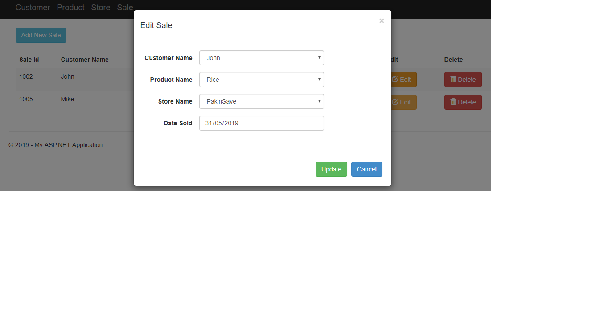

# Retail Management System
This project is an MVC application which has Customer, Store, Product and Sale entities that enables the CRUD operations.

## Home Screen
The main menu has 4 entities which are Customer, Product, Store and Sale. Each menu has Add, Edit and Delete functionalities.

	

## Add Customer

	

## Edit Customer

	

## Delete Customer

	

	

## Add New Sale

	

## Edit Sale

	

## Delete Sale

	

## Database relationship diagram

	

